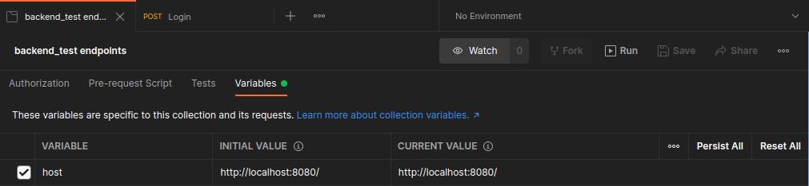
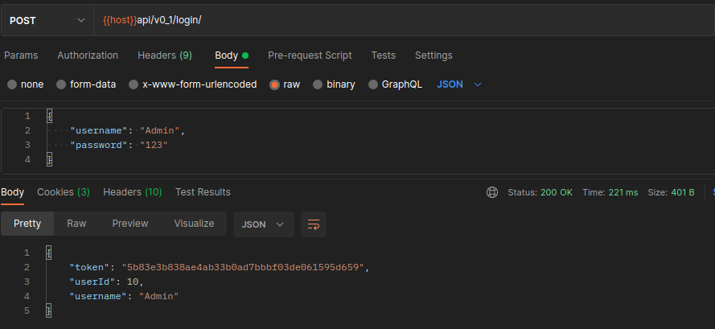
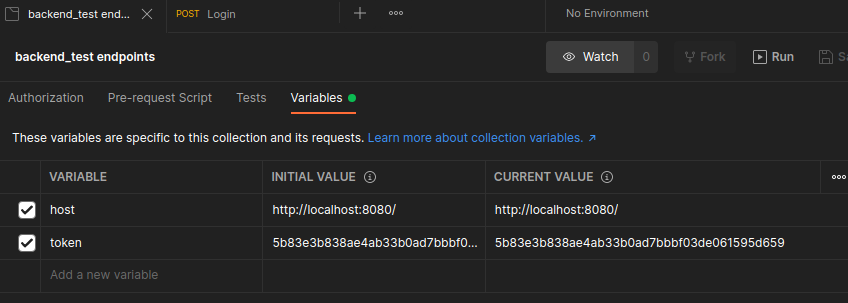

# Backend test

## Set up
### Build DRF app and celery

`make build-app`

`make build-worker`

### Start project
`make up`

### Run fixtures
`make fixtures`

### (Optional) Stop Celery
Celery is used to asyn task to send emails, we can stop it

`make stop-celery`

### Run tests

`make tests`

### Postman (Client) tests

Download the file `backend_test endpoints.postman_collection.json`

1. Update the `host` value with a valid host

2. Make login

In the view login use a valid username and passwword to login, then use copy the value of `token` in the response

3. Update the `token` value

